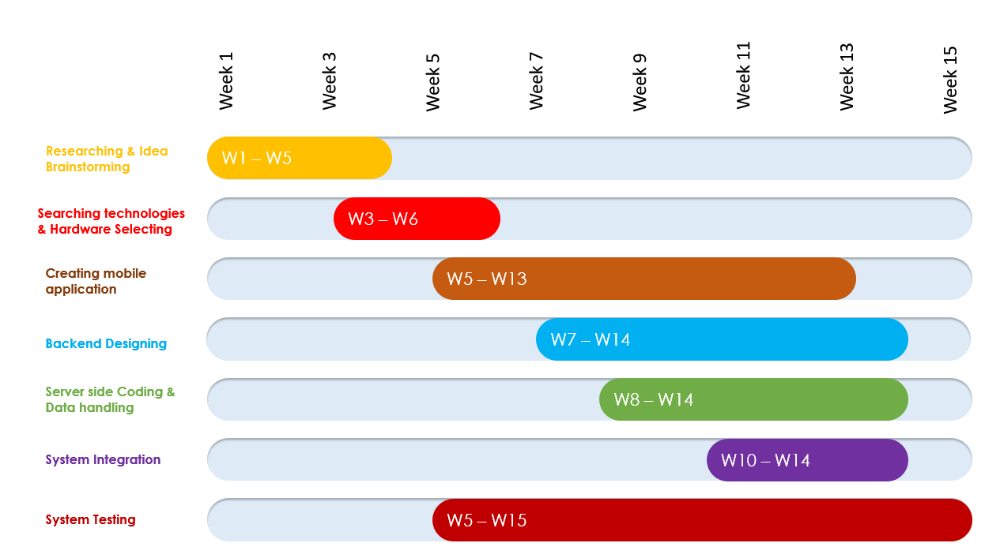
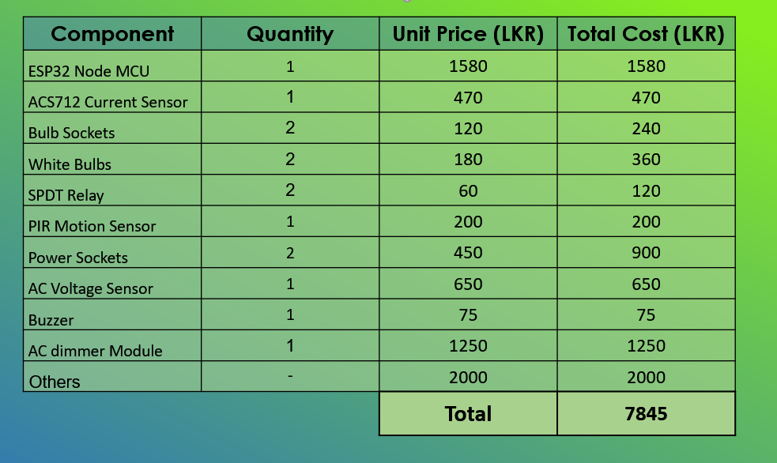

[//]: # (Please refer the instructions in below URL for the configurations)
[//]: # (https://projects.ce.pdn.ac.lk/docs/how-to-add-a-project)

# SMART HOME

#### Table of Contents
* [Introduction](#introduction)
* [Our Solution](#our-solution )
* [UI](https://github.com/cepdnaclk/e17-3yp-smart-home/tree/main/UI-Images)
* [Scametic Diagram](https://github.com/cepdnaclk/e17-3yp-smart-home/tree/main/Scematic%20diagram)
* [Timeline](#Timeline)
* [Estimated Budget](#Estimated-Budget)
* [Team Members](#team-members)
* [Supervisors](#supervisors)
* [Related Links](#related-links)

## Introduction

### Over View
The idea of smart home exist for many years. The core idea of Smart Home is remotle controling of switches and bulbs. But we added some inovative features to the core idea
and make it more smarter.

#### Smart Bulbs

Our goal is to provide a futuristic lightning system to our loyal users. 
We have also identified smart lighting as an integral part of a smart home.
Smart lightning mainly focused on energy efficiency and remote control.
But we also provide many other futuristic features to our smart system. 
Join us to build a futuristic society with less energy waste.
Be in control from anywhere with control right in the mobile app.

#### Smart Switches

Smart switches have some features as smart bulbs. They can also controllable by remote or voice command. We can see the power usage and the charge percentage of the mobile or any other device. They are far safer than traditional switches. 

#### Smart Curtain

Smart curtains more like the others they can be remotley controllable and it can semi automated.
With the environmental conditions the curtains can react. 

## Our Solution

Our solution Architecture contains two types of devices, they are Smart-Bulbs & the Smart-Switchs. They both devices, sensors like motion sensor, AC current sensor, AC voltage sensor and the Rellay are directly connected with the Central Unit. Our mobile application and the central unit connectedto the cloud via internet. So they can communicate with them-self. The central unit will use the MQTT protocol to communicate with the server.

The energy consumption monitoring, this is a feature embeded with all the switches to calculate the energy consumption and update it to the cloud. This is can be implemented using Two sensor AC Current sensor and AC voltage sensor.

Motion Sensing, Motion sensing is another feature built-in with the bulbs, The motion sensors are connected to the central unit. When a motion detected or the central unit wil turn on the bulb and if no motion/human detected the CU will turn off the bulb.

Mobile applications communicate with the central unit through the cloud or diretly using wifi router. The User settings, user data, and the reports will be stored in the cloud/server.

## Timeline

## Estimated Budget

## Team Members
1. E/17/015 Arshad M.R.M.  [[Website](http://www.ce.pdn.ac.lk/e17-batch/), [Email](mailto:e17015@eng.pdn.ac.lk)]
2. E/17/230 Nishankar S. [[Website](http://www.ce.pdn.ac.lk/e17-batch/), [Email](mailto:e17230@eng.pdn.ac.lk)]
3. E/17/358 Varnaraj N. [[Website](http://www.ce.pdn.ac.lk/e17-batch/), [Email](mailto:e17358@eng.pdn.ac.lk)]

## Supervisors
1. Dr. Isuru Nawinne [[Website](http://www.ce.pdn.ac.lk/academic-staff/isuru-nawinne/), [Email](mailto:isurun@eng.pdn.ac.lk)]
2. Dr. Mahanama Wickramasinghe [[Website](http://www.ce.pdn.ac.lk/2021/05/02/dr-mahanama-wickramasinghe/), [Email](mailto:mahanamaw@eng.pdn.ac.lk)]

## Related Links

1. [Project Repository](https://github.com/cepdnaclk/e17-3yp-smart-home)
2. [Project page](https://cepdnaclk.github.io/e17-3yp-smart-home)
3. [Department of computer engineering](http://ce.pdn.ac.lk)
4. [Faculty of Engineering](http://eng.pdn.ac.lk/)
5. [University of Peradeniya](https://www.pdn.ac.lk/academics/academics.php/)
